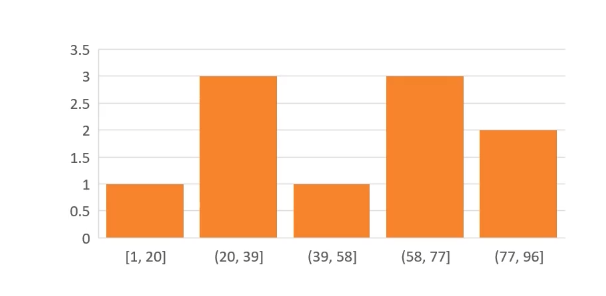

도수 분포표와 히스토그램, 데이터 비닝(data binning), 근사(approximation)

## 도수 분포표

- 특정 구간에 속하는 자료의 개수를 나타내는 표

- 연속적인 데이터도 구간으로 나누면 이산적인 데이터가 됨

- 예

  - | 범위                | 도수 |
    | ------------------- | ---- |
    | 155cm 이상 165 미만 | 3    |
    | 165cm 이상 175 미만 | 12   |
    | 175cm 이상 185 미만 | 10   |
    | 185cm 이상 195 미만 | 1    |

- 각 구간의 폭 계산법

  - 폭 = (최대 - 최소) / 구간 개수
  - 정수로 안 떨어질 경우 올림

### 도수 분포표의 한계

- 2차원 표에 숫자가 적힌 모양

- 값의 분포를 한눈에 보기 어려움

## 히스토그램

- 도수 분포표를 그래프화 한 것
- 값의 분포를 한눈에 보기 쉬움
- 여태까지 본 기타 분포 그래프와 크게 다르지 않음



## 데이터 비닝(data binning)

- 도수 분포표 및 히스토그램은 데이터 비닝의 한 종류
- 영어에서 bin은 그냥 통을 의미
- binning은 어떤 규칙에 따라 물건들을 분류해서 올바른 통에 넣는 것을 의미

### 범위를 특정할수 없는 데이터 비닝

- 해시 함수가 해결할수 있음

## 해시 함수

- 규칙
  - 입력값은 임의의 길이를 가질 수 있음
  - 출력값은 언제나 정해진 길이를 가짐(예: 32비트)
  - 입력값이 같으면 언제나 출력값도 같음
    - 함수면 반드시 만족해야 하는 규칙
    - 데이터 비닝에 사용했던 다른 규칙도 동일


## 해시 함수의 성질

- 어떤 문자열을 넣으면 정해진 길이의 출력이 나옴
- 입력이 같으면 결과도 언제나 같음
- 입력이 다르면 다른 결과가 나옴 (길이는 같음)
- 입력이 다른데 출력이 같은경우도 있음
  - 해시 충돌
- 해시 값으로부터 원본 데이터 복구는 불가능
  - 이유
    - 함수(임의 길이) -> 정해진 길이로 바꾸기 때문
      - 원본 데이터의 길이보다 해시 값의 길이가 작을 수도 있단 뜻
      - 즉 원본을 표현하기 위해 필요한 모든 데이터가 없을 수도
      - 이런 이유 때문에 보안에서 비밀번호를 저장하는 용도로 많이 쓰임

## 해심 함수의 종류와 예

​	

- 간단한 해시 함수 : x65599

```c#
// 65599를 곱해나가는 해시 함수
public static uint CalculateHash65599(string str)
{
	uint hash = 0;
    for(int i=0; i< str.length; ++i)
    {
        hash = 65599 * hash + str[i];
    }
    return hash ^ (hash >> 16);
}
```

## 해시 함수의 용도

1. 자료의 검색 속도 향상용
   - 문자열에서 곧바로 bin의 위치를 알 수 있음
2. 보안
   - 비밀번호 저장용

## 해시 함수와 비밀번호 저장

- 정형화된 데이터: 배열
- 비 정형화된 데이터 : 해시 기반 자료구조

## 근삿값 구하기

- 근삿값
  - 근사 계산을 통해 얻은 수치로 실제 값에 가까운 값
  - 정확도가 조금 떨어져도 상관 없는 경우 근삿값을 종종 이용
  - 실제 통계에서 본 많은 것들이 근삿값
    - 예 : 가우시안 분포
    - 개개의 데이터보다 전체 데이터의 의미를 파악하고 싶기 때문
    - 이항 분포를 빨리 계산하기 위해 근사계산(연속 함수)를 사용하기도 했음
  - 근삿값은 반드시 통계에만 국한되지 않음
    - 복잡한 계산을 조금은 덜 정확하지만 빠른 계산으로 바꾸기 위해서도 사용
    - 머신러닝에서 무수히 많은 여러 개의 조건문을 근사공식으로 바꾸기도 함
    - 특히 실시간 프로그램에 사용하기에 그 계산이 너무 느린 경우
  - 어떤 분포를 대표할 수 있는 연속 함수가 있다면?
  - 복잡한 함수를 대체할 수 있는 근사 함수가 있다면?

## 최적선

- 다른 말로 추세선

  - 최대한 많은 점 에 가깝게 그리는 직선

  - 해당 직선은 실제 데이터를 푠할 수도 아닐 수도 있음

  - 다음 방정식을 만족 해야함

    - y = mx +b

      - 이 직선 상에 있는 값과 실제 값은 오차가 있을 수 있음

      - y' - y가 오차

        

- 최적선 그리는 방법


## 곡선 맞춤

- 개념은 최적선과 비슷함
- 곡선이 한번 꺽일 때마다 최고차항이 증가
- 한번 휘면 제곱
- 두번 휘면 세제곱
- 휜 횟수에 따라 최고차항이 하나씩 증가
